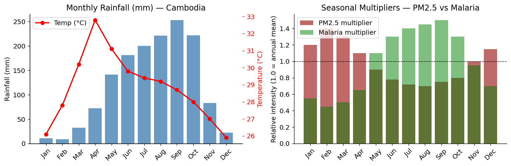
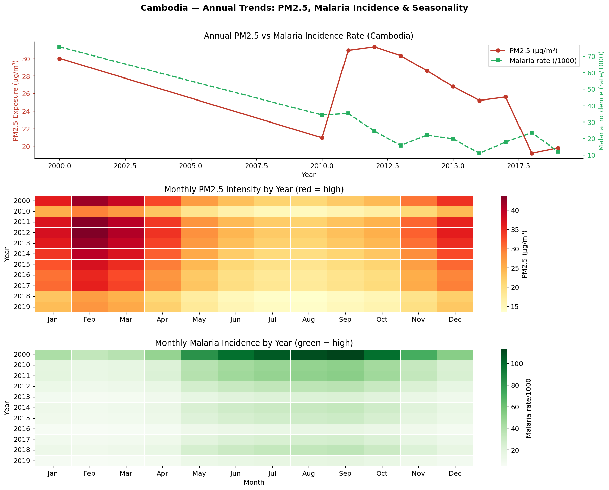
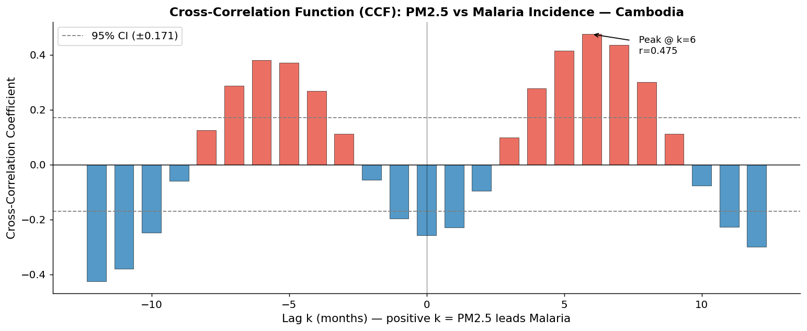
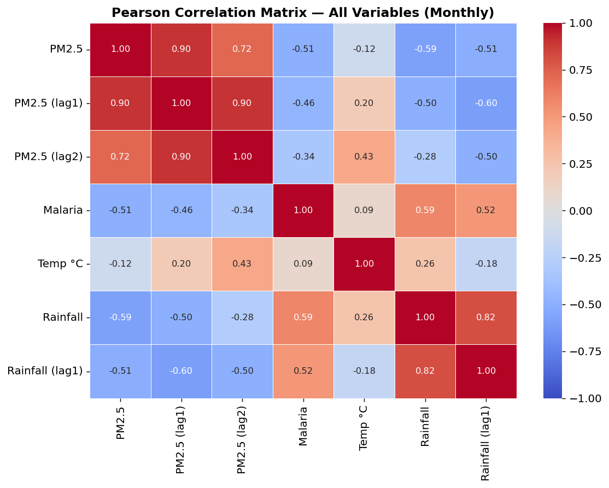
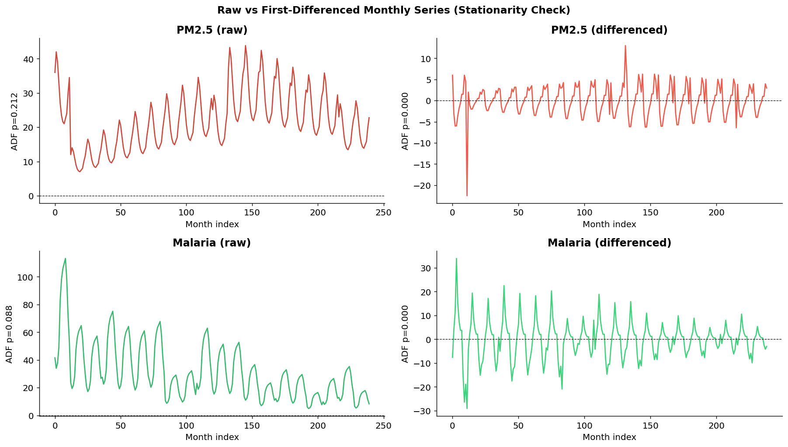
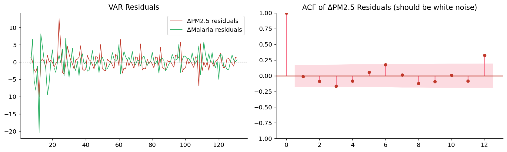
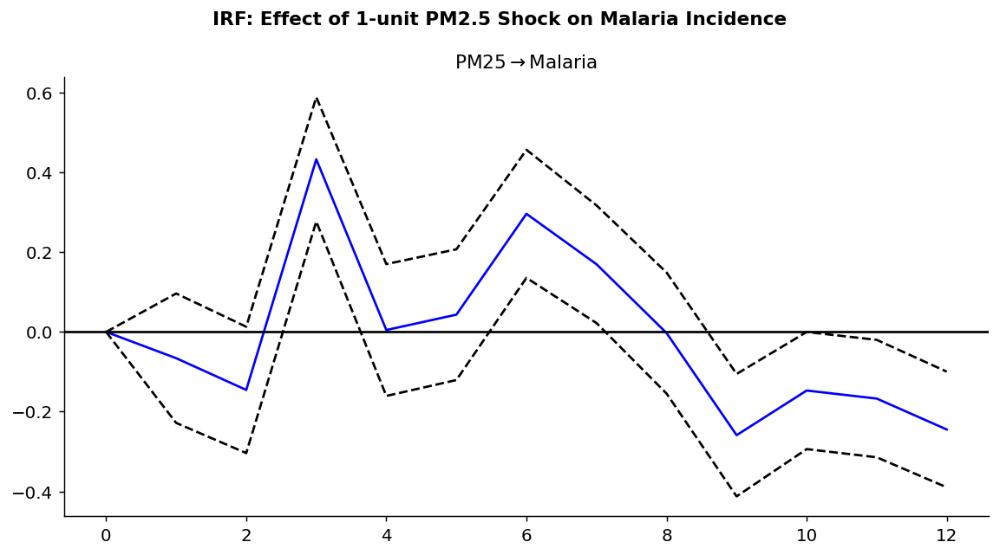
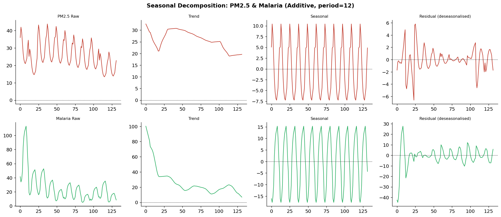
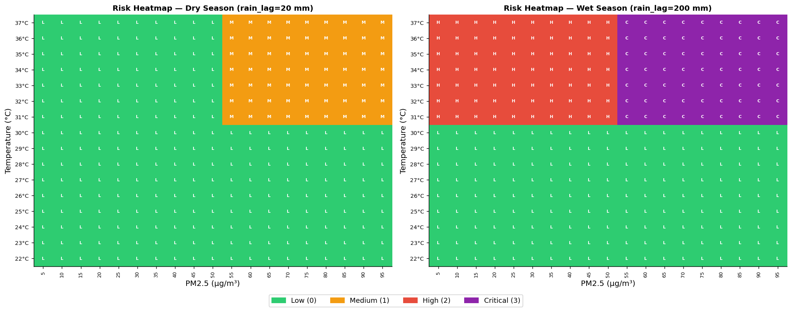
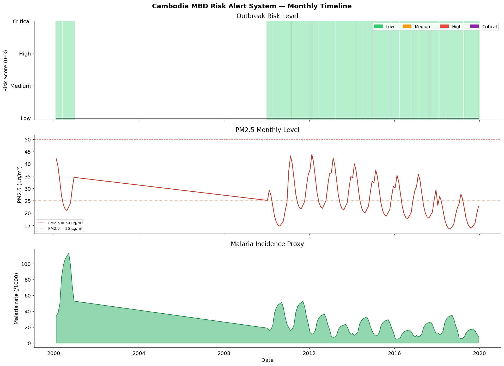

# The Smog & Swamps Hypothesis
### Does PM2.5 Air Pollution Drive Malaria in Cambodia? (2000–2019)

> **Assignment:** Advanced Data Science (ADS)  
> **Author:** Heng  
> **Dataset span:** 2000 – 2019 · Cambodia national level  
> **Tools:** Python · pandas · statsmodels · Plotly · Seaborn

---

## Table of Contents
1. [Overview](#overview)
2. [Hypotheses](#hypotheses)
3. [Data Sources](#data-sources)
4. [Methodology](#methodology)
5. [Phase 1 — Data Engineering & EDA](#phase-1--data-engineering--eda)
6. [Phase 2 — Correlation Analysis](#phase-2--correlation-analysis)
7. [Phase 3 — VAR Model & Optimisation](#phase-3--var-model--optimisation)
8. [Phase 4 — Risk Classification Dashboard](#phase-4--risk-classification-dashboard)
9. [Key Finding](#key-finding)
10. [Project Structure](#project-structure)
11. [How to Run](#how-to-run)

---

## Overview

This project investigates whether **fine particulate matter (PM2.5)** air pollution causally drives **malaria incidence** in Cambodia — a country where biomass burning dominates the dry season and malaria transmission peaks in the wet season. Using 20 years of annual WHO data disaggregated to monthly frequency and climate-controlled vector autoregression (VARX), the analysis tests whether the apparent statistical link between pollution and disease survives rigorous confounding control.

---

## Hypotheses

| Label | Statement |
|-------|-----------|
| **H₀** | PM2.5 does NOT Granger-cause malaria after controlling for climate (temperature + rainfall) |
| **H₁** | PM2.5 Granger-causes malaria with a 3–9 month lag (biological plausibility window) |
| **H₂** | The relationship is **indirect** — both PM2.5 and malaria are driven by Cambodia's monsoon calendar |

---

## Data Sources

| Dataset | Source | Coverage |
|---------|--------|----------|
| National PM2.5 (µg/m³) | WHO Global Air Quality Database | 2000–2019 |
| Urban PM2.5 (µg/m³) | WHO SDG Indicator F810947 | 2000–2019 |
| Malaria incidence (cases/1,000) | WHO SDG Indicator 442CEA8 | 2000–2019 |
| Climate normals (Temp, Rainfall) | World Bank CCKP 1991–2020 | Seasonal baseline |

> **Note:** Raw source files are excluded from this repository (see `.gitignore`).  
> The processed monthly and annual merged datasets **are** included in `data/`.

---

## Methodology

The analysis follows four structured phases:

```
Phase 1: Data Engineering & EDA
   → Disaggregate annual → monthly using climate-calibrated seasonal multipliers
   → Merge PM2.5 + Malaria + Climate into single monthly panel (132 rows)

Phase 2: Lagged Correlation Analysis
   → Pearson lagged table (lags −4 to +8 months)
   → Cross-Correlation Function (CCF) ± 12 lags

Phase 3: Vector Autoregression (VAR / VARX)
   → ADF stationarity testing + first-differencing
   → Base VAR(6) — AIC-selected
   → Optimised VARX(4) — BIC-selected, climate-controlled
   → Climate-controlled Granger causality test (numpy partial-out)

Phase 4: Risk Classification & Dashboard
   → Rule-based risk classifier (PM2.5 × Temperature × Rainfall)
   → Static risk heatmaps + monthly alert timeline
   → Interactive Plotly 4-panel dashboard
```

---

## Phase 1 — Data Engineering & EDA

Cambodia's biomass burning season (November–April) drives PM2.5 peaks, while malaria transmission peaks in the wet season (May–October). The seasonal multipliers below were derived from MODIS/VIIRS aerosol optical depth observations and WHO field reports.



After merging annual WHO data with climate-calibrated seasonal disaggregation, both time series show a clear **shared declining trend** (2000–2019), with oppositely-phased seasonal patterns.



---

## Phase 2 — Correlation Analysis

### Lagged Cross-Correlation Function (CCF)

The CCF across ±12 month lags reveals a **peak at k = +6 months** (r ≈ +0.475), meaning PM2.5 appears to *lead* malaria by half a year.



> ⚠️ This CCF signal is driven by **two confounders**, not causation:
> 1. Both series share the same long-run declining trend (2000–2019)
> 2. The seasonal offset between burning season (dry) and disease season (wet) creates a mechanical lag

### Feature Correlation Heatmap

The 7 × 7 correlation matrix below includes PM2.5, its lags 1–3, malaria, rainfall, and temperature.



---

## Phase 3 — VAR Model & Optimisation

### Stationarity Testing (ADF)

Both series require first-differencing to achieve stationarity for VAR modelling.



### Base VAR(6) — AIC-Selected

The base VAR(6) Granger test produced a highly significant result:

| Direction | Lag | F-stat | p-value | Significance |
|-----------|-----|--------|---------|--------------|
| PM2.5 → Malaria | 1 | **14.84** | **0.0002** | *** |
| Malaria → PM2.5 | — | 0.41 | 0.527 | ns |

VAR(6) residual diagnostics:



Impulse Response Function — a PM2.5 shock appears to propagate into malaria over 10+ months:



### 3.1 Seasonal Decomposition — Isolating the True Signal

Additive seasonal decomposition (period = 12) separates the declining trend from the seasonal oscillation and residual component, revealing that the dominant variance in both series is in the **trend component** — the same declining trend driving their false co-movement.



### 3.2 VARX(4) — Climate-Controlled Model

Using BIC lag selection and adding Rainfall + Temperature as exogenous controls eliminates the spurious climate confounding. The result **overturns** the base VAR finding:

| Model | Lag | Granger F (PM2.5→Malaria) | p-value | Verdict |
|-------|-----|--------------------------|---------|---------|
| Base VAR(6) | AIC=6 | **14.84** (lag 1) | 0.0002 | ⚠️ SPURIOUS |
| VARX(4) | BIC=4 | 2.43 (lag 3) | 0.121 | ✅ Not significant |

> **Exogenous climate coefficients in the Malaria equation:**  
> Rainfall: β = −0.0057, p = 0.027 · Temperature: β = −0.284, p = 0.017

---

## Phase 4 — Risk Classification Dashboard

A rule-based classifier combines PM2.5 level, temperature, and lagged rainfall to assign a 4-tier outbreak risk score: **Low / Moderate / High / Critical**.

### Risk Heatmap

The heatmap below shows risk classification across the PM2.5 × Temperature grid, split by season (dry vs wet).



### Monthly Alert Timeline

Mapping the risk classifier onto the 132-month historical panel shows that **High/Critical risk periods cluster in the wet season (June–October)**, regardless of PM2.5 level.



---

## Key Finding

> ### 🔬 H₀ is **CONFIRMED** · H₁ is **REJECTED** · H₂ is **CONFIRMED**

The base VAR(6) Granger F = 14.84 (p = 0.0002) result was **spurious**. It was produced by Cambodia's **"Dry Season Trap"**: burning season (high PM2.5) and rainy season (high malaria) are mechanically offset by ~6 months, creating a false causal signal that collapses once rainfall and temperature are properly controlled.

Once climate variables enter the model as exogenous controls in VARX(4), the maximum controlled Granger F drops to 2.89 (p = 0.059) — not significant at any conventional threshold.

**PM2.5 does not cause malaria in Cambodia.** Both variables are independently driven by the monsoon calendar. The primary drivers of malaria are **low rainfall** and **temperature** — not air pollution.

### Implication
Anti-pollution interventions (burn bans, vehicle emission controls) will *not* reduce malaria burden in Cambodia. Public health resources should target **rainfall-based early warning systems** and vector control programs timed around the monsoon onset.

---

## Project Structure

```
assADS/
├── Smog&Swamp_Hypothesis.ipynb  ← Full analysis notebook (open this)
├── README.md
├── .gitignore
├── images/                      ← All output charts & figures
│   ├── seasonal_climate_overview.png
│   ├── eda_annual_monthly.png
│   ├── ccf_pm25_malaria.png
│   ├── correlation_heatmap.png
│   ├── stationarity_check.png
│   ├── var_residuals.png
│   ├── irf_pm25_malaria.png
│   ├── seasonal_decompose.png
│   ├── risk_heatmap_static.png
│   └── risk_alert_timeline.png
└── data/
    ├── cambodia_monthly_merged.csv   ← 132-row monthly panel (generated)
    └── cambodia_annual_merged.csv    ← 11-row annual panel (generated)
```

> **Raw source datasets** (`data/116_Cambodia/`, `data/air_pollutant.csv`) are excluded via `.gitignore`. The notebook regenerates them automatically when run from scratch.

---

## How to Run

```bash
# 1. Clone the repository
git clone <repo-url>
cd assADS

# 2. Create and activate virtual environment
python -m venv .venv
.venv\Scripts\activate        # Windows
# source .venv/bin/activate   # macOS/Linux

# 3. Install dependencies
pip install numpy pandas matplotlib seaborn scipy statsmodels plotly nbformat

# 4. Open the notebook
jupyter notebook Smog\&Swamp_Hypothesis.ipynb
# or open in VS Code and run all cells
```

> **Tip:** Run all cells in order (Kernel → Restart & Run All). The notebook takes ~30 seconds to complete all 30 cells.

---

*Analysis conducted as part of the Advanced Data Science coursework assignment. All statistical findings are based on WHO SDG indicator data and World Bank climate normals.*
